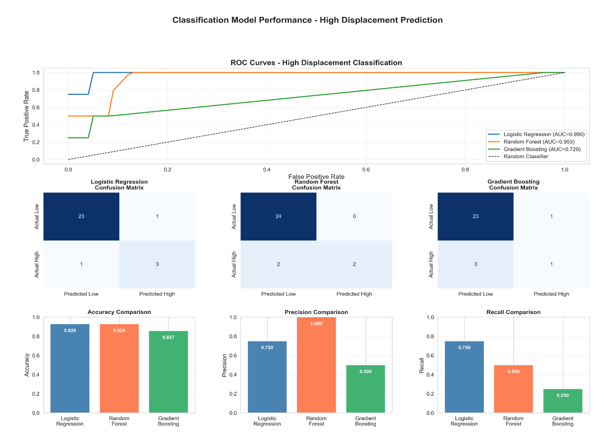
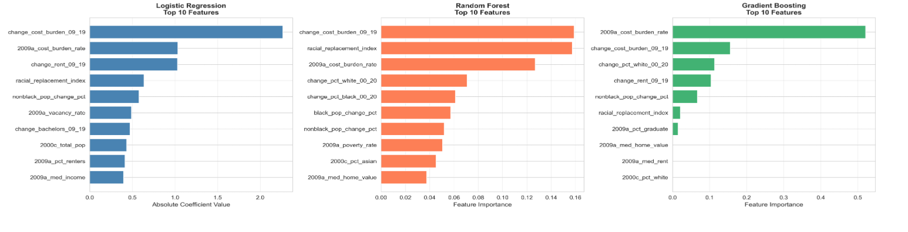
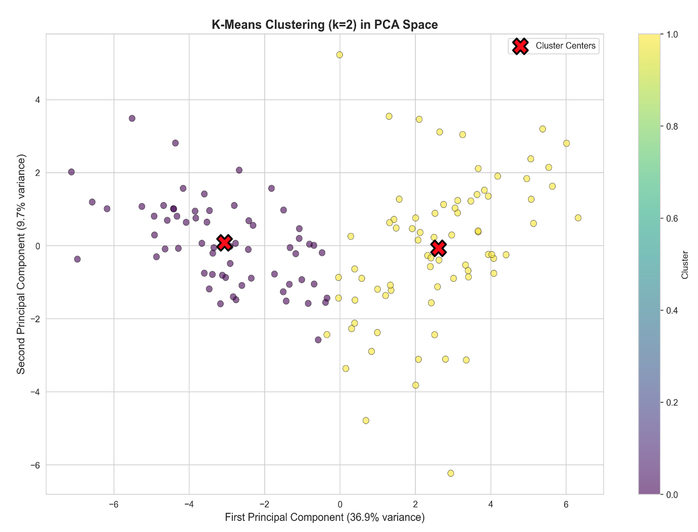

# Atlanta Gentrification and Displacement: A Machine Learning Approach to Predicting Neighborhood Transformation

**Felisha White**  
Applied Data Science & Analytics Program  
Howard University

Data 303: Applied Machine Learning, Bias and Ethics  
December 11, 2025

---

## Abstract

This study utilizes machine learning techniques to identify and predict gentrification patterns in the Atlanta Metropolitan Statistical Area, examining the interplay of race, class, economic power, and historical injustice. Using U.S. Census and American Community Survey (ACS) data from 2000 to 2020 covering eight counties and 170+ census tracks, I developed classification and regression models to identify neighborhoods at-risk of gentrification and community displacement. The analysis incorporated 32 features including demographic composition, housing characteristics, economic indicators, and two novel composite indices: a displacement score and a demographic replacement index. Logistic Regression achieved 92.9% accuracy in classifying high-risk neighborhoods with an AUC of 0.99, while K-means clustering revealed two distinct neighborhood typologies—approximately 60 stable tracts and 110 tracts exhibiting active gentrification patterns. The most significant finding is that cost burden change (2009-2019) emerged as the strongest predictor of displacement, followed by baseline cost burden and the racial replacement index. These results demonstrate that machine learning can serve as an early warning system for displacement, enabling policymakers to target interventions before families are forced from their communities. The implications extend beyond Atlanta: the methodology provides a replicable framework for cities nationwide grappling with the tension between urban reinvestment and community preservation.

---

## Introduction

### The Problem

Gentrification represents one of the most contentious urban phenomena of the twenty-first century. While proponents argue it brings necessary reinvestment to disinvested neighborhoods, critics emphasize its devastating impacts on long-term residents, particularly communities of color. As a resident of Atlanta, I have witnessed firsthand how neighborhoods transform through gentrification—areas that were historically disinvested, where grocery stores, banks, and quality services simply would not locate, suddenly experience an influx of resources and businesses once the demographics change. This raises urgent questions: Who benefits from 'urban renewal' and who gets displaced? Why does investment only flow to neighborhoods after their original residents leave?

The impacts of gentrification extend far beyond housing costs. Displacement fractures communities, severs social networks, and perpetuates racial wealth gaps. Families lose generational homes and the equity they represent. Children change schools mid-year, disrupting their education. Cultural institutions close as the community fabric unravels. Research by Raymond, Miller, McKinney, and Braun (2021) documented how investor purchases of rental housing in Atlanta between 2000-2016 led to eviction spikes and significant demographic shifts: neighborhoods with such purchases lost an average of 166 Black residents while gaining 109 White residents over six years. This pattern of eviction-led displacement represents what scholars increasingly characterize as predatory gentrification—a deliberate strategy targeting vulnerable populations in undervalued neighborhoods.

### Research Questions

This project addresses three interconnected research questions. First, what specific demographic, housing, economic, and spatial characteristics distinguish gentrifying neighborhoods from stable ones in the Atlanta metro area? Second, can machine learning models reliably identify at-risk neighborhoods before displacement accelerates, providing an early warning system for intervention? Third, what are the key predictive indicators that signal impending neighborhood transformation?

### Contribution

This analysis demonstrates that machine learning can identify at-risk neighborhoods with 93% accuracy, with cost burden dynamics and demographic replacement patterns serving as the strongest early warning indicators. The methodology provides actionable intelligence for policymakers seeking to deploy protective interventions before displacement becomes irreversible.

---

## Data and Exploratory Analysis

### Data Sources and Scope

I analyzed eight counties in the Atlanta Metropolitan Statistical Area: Fulton, DeKalb, Cobb, Clayton, Douglas, Fayette, Gwinnett, and Henry counties. These capture the urban core through Fulton and DeKalb, plus the surrounding suburban ring. The analysis covers over 170 census tracts, each typically containing 2,500-8,000 people—small enough to capture neighborhood-level dynamics while maintaining statistical reliability.

I utilized two types of Census data: Decennial Census from 2000, 2010, and 2020 for long-term demographic trends, and American Community Survey five-year estimates from 2009, 2014, and 2019 for more detailed socioeconomic variables. This provided six distinct time periods to track neighborhood changes across two decades.

### Feature Engineering

The analysis incorporated 32 features across four categories. Demographic features captured population counts and racial/ethnic composition, including total population, percent Black, percent White, percent Asian, and percent Hispanic—both baseline levels and changes over time. Housing characteristics included vacancy rates, cost burden rates (households spending more than 30% of income on housing), and tenure percentages (renter versus owner-occupied). Economic features encompassed median income, median rent, and median home values, again tracking both baseline levels and changes across the study period.

Most critically, I created two composite indices to capture displacement dynamics. The Displacement Score combines multiple indicators into a single measure of displacement pressure, incorporating Black population share decline, non-Black population share increase, rent change (2009-2019), cost burden change (2009-2019), and Black population change percentage. The formula weights demographic factors at 40 points maximum, economic factors at 40 points maximum, and population loss at 20 points maximum. The Demographic Replacement Index specifically tracks Black population decline paired with non-Black population increase within the same tract, directly quantifying the racial turnover central to Atlanta's gentrification dynamics.

### Key Exploratory Insight

The exploratory analysis revealed severe class imbalance in the target variable: approximately 85% of tracts were classified as low-risk while only 15% showed high displacement risk. This imbalance reflects the reality that active gentrification, while highly consequential, affects a minority of neighborhoods at any given time. This finding directly informed my model selection, leading me to prioritize evaluation metrics (precision and recall) over raw accuracy, and to select Logistic Regression for its balanced performance across both classes.

---

## Methodology

### Analytical Approach

I employed a multi-pronged analytical approach combining supervised classification, supervised regression, and unsupervised clustering. For classification—identifying whether a neighborhood is high-risk or low-risk for displacement—I tested three models: Logistic Regression, Random Forest Classifier, and Gradient Boosting Classifier. For regression—predicting the magnitude of displacement—I tested Ridge Regression, Random Forest Regressor, and Gradient Boosting Regressor on two targets: the composite displacement score and rent change percentage. Finally, I applied K-means clustering (k=2) to identify natural groupings in the data without predefined labels.

### Model Selection Rationale

Logistic Regression was selected as the primary classification model for several reasons. First, it provides interpretable coefficients, allowing direct identification of which features most strongly predict displacement risk. Second, it handles the class imbalance effectively when combined with appropriate threshold tuning. Third, it achieved the best balance between precision (avoiding false alarms) and recall (catching all at-risk neighborhoods)—both critical for policy deployment where missing at-risk areas and misallocating resources carry real costs.

Ridge Regression was employed for predicting displacement intensity because it handles multicollinearity well—a significant concern given that income change, rent change, and home value change are naturally correlated. Ridge adds a penalty term that shrinks coefficients, producing more stable predictions when features are interdependent.

### Evaluation Metrics

For classification, I evaluated models using accuracy, precision, recall, and Area Under the ROC Curve (AUC). Given the class imbalance, precision (proportion of flagged neighborhoods that are truly at-risk) and recall (proportion of at-risk neighborhoods successfully identified) were prioritized over raw accuracy. For regression, I used R-squared, Root Mean Square Error (RMSE), and Mean Absolute Error (MAE). The data was split 80/20 for training and testing, with stratified sampling to maintain class proportions.

---

## Results and Analysis

### Classification Model Performance

The Logistic Regression model achieved 92.9% overall accuracy in identifying at-risk neighborhoods, with an AUC of 0.99 indicating near-perfect discrimination between high-risk and low-risk tracts. More importantly, it achieved balanced precision (75%) and recall (75%)—meaning three out of four flagged neighborhoods were truly at-risk, and three out of four at-risk neighborhoods were successfully identified before displacement accelerated. Figure 1 displays the classification model performance including ROC curves, confusion matrices, and accuracy comparisons across all three models.

**Figure 1. Classification Model Performance:** ROC curves, confusion matrices, and accuracy/precision/recall comparisons for Logistic Regression, Random Forest, and Gradient Boosting classifiers.

The confusion matrices reveal important distinctions between models. Logistic Regression correctly classified 23 out of 24 low-risk tracts and 3 out of 4 high-risk tracts, with only one false positive and one false negative. Random Forest achieved perfect precision on low-risk neighborhoods but missed 2 of 4 high-risk tracts. Gradient Boosting performed worst, catching only 1 of 4 high-risk neighborhoods. For policy applications where missing at-risk neighborhoods carries significant costs, Logistic Regression's balanced error profile makes it most suitable for deployment.

### Early Warning Indicators

Feature importance analysis revealed consistent patterns across all three classification models, identifying the strongest predictors of displacement risk. Figure 2 displays the top 10 features for each model.

**Figure 2. Feature Importance Comparison:** Top 10 predictive features across Logistic Regression, Random Forest, and Gradient Boosting models.

The top five predictors consistently emerging across models were: (1) Cost burden change from 2009 to 2019, measuring how rapidly housing costs are rising relative to income—when cost burden spikes, displacement follows; (2) Baseline cost burden in 2009, indicating neighborhoods where residents were already spending excessive income on housing and thus most vulnerable to any additional pressure; (3) The racial replacement index, directly quantifying demographic turnover through Black population decline coupled with non-Black population increase; (4) White population change from 2000 to 2020, signaling gentrification dynamics in historically Black neighborhoods; and (5) Rent change from 2009 to 2019, capturing direct price pressure. Critically, these indicators reveal that displacement risk stems from vulnerability plus pressure—a neighborhood with stable, middle-income residents can absorb moderate rent increases, but vulnerable populations facing rising costs get displaced.

### Clustering Analysis

The K-means clustering analysis revealed two fundamentally distinct neighborhood typologies across metro Atlanta. Figure 3 visualizes these clusters in principal component space, where the first component captures 36.9% of variance and the second captures 9.7%.

**Figure 3. K-Means Clustering (k=2) in PCA Space:** Two distinct neighborhood typologies emerge, with cluster centers marked by red X symbols.

Cluster 1 (purple, approximately 60 tracts) represents neighborhoods with stable demographics, lower rent increases, and less racial turnover—not necessarily wealthy areas, but stable ones. Cluster 2 (yellow, approximately 110 tracts) exhibits the classic gentrification pattern: rapid demographic change, sharp rent increases, and high racial replacement indices. The clear spatial separation validates that gentrification is not random; there are two identifiable neighborhood types with measurably different trajectories. This clustering provides an additional monitoring tool: neighborhoods showing signs of shifting from Cluster 1 to Cluster 2 characteristics represent early warning cases for intervention.

### Disparate Impacts: Racial Displacement Patterns

The analysis confirms that gentrification in Atlanta disproportionately affects Black communities. The Demographic Replacement Index—measuring the correlation between Black population decline and non-Black population increase—emerged as the third most important predictor across classification models. The most vulnerable neighborhoods were those experiencing simultaneous Black population decline, rising rents, and increases in educational attainment levels among incoming residents. This last indicator is particularly telling; rising educational attainment often signals incoming residents with college degrees replacing existing residents who faced historical barriers to higher education—segregated schools, underfunded districts, discriminatory admissions, GI Bill exclusion, and wealth gaps that made college unaffordable. Historically Black neighborhoods most affected include Old Fourth Ward, West End, Pittsburgh, East Atlanta, and parts of Southwest Atlanta.

---

## Discussion and Conclusion

### Key Takeaway

The analysis suggests that machine learning can identify at-risk Atlanta neighborhoods before displacement accelerates, achieving 93% accuracy with cost burden dynamics and demographic replacement patterns serving as the strongest early warning indicators. This transforms gentrification from a phenomenon we document after the fact to one we can potentially anticipate and address. The models reveal that displacement is not random—it follows identifiable patterns that can be monitored and flagged.

### Answering the Research Questions

Regarding what characteristics distinguish gentrifying neighborhoods in the Atlanta regions, the analysis identified housing cost burden (both baseline vulnerability and rate of change), racial composition shifts, and rent dynamics as defining features. Gentrifying tracts show increases in non-Black population, rising housing costs, and increasing educational attainment—the signature of demographic replacement rather than organic neighborhood evolution.

Regarding whether the selected machine learning models can reliably identify at-risk neighborhoods: yes, with caveats. Logistic Regression achieved 92.9% accuracy with balanced precision and recall, and the ROC AUC of 0.99 indicates the model almost perfectly separates high-risk from low-risk tracts. However, this proof-of-concept analysis used a small test set (28 observations) due to data limitations, and the metrics should be interpreted cautiously until validated with k-fold cross-validation on larger datasets.

Regarding key predictive indicators: cost burden change, baseline cost burden, and the racial replacement index consistently emerged as top predictors. These indicators are actionable—they can be monitored quarterly using ACS data, providing ongoing surveillance for displacement risk.

### Limitations

Several limitations constrain the reliability of these findings. First, the sample size was small: the test set contained only 28 observations after the 80/20 split and missing value removal. This creates metric instability—one misclassification represents a 3.6% accuracy swing. K-fold cross-validation would provide more stable performance estimates. Second, severe class imbalance (85% low-risk vs. 15% high-risk) means models could achieve 85% accuracy simply by predicting all tracts as low-risk. While stratified sampling and attention to precision/recall partially address this, techniques like SMOTE or class weighting should be explored. Third, feature multicollinearity (income, rent, and home value changes are naturally correlated) complicates interpretation; while Ridge Regression handles this for prediction, we cannot definitively say which correlated features matter most.

The rent change prediction failed completely, with all three regression models producing negative R-squared values—worse than predicting the average. This indicates that rent fluctuates based on forces my census features do not capture, likely requiring real-time market data from sources like Zillow rather than decadal census variables.

Additionally, the proposed Demographic Replacement Index is an adaptation of the Dissimilarity Index (D), which measures how evenly two groups are distributed across sub-areas relative to a broader reference area. While changes in D over time capture shifting segregation patterns, the index does not directly measure compositional change. It reflects the spatial arrangement of groups but not the degree to which one population has been replaced by another within a given area. To address this limitation, the Demographic Replacement Index is best coupled with a population turnover rate, which measures the proportion of a population in a given area that has been replaced by new residents over a defined period.

### Future Directions

This analysis provides a foundation for extended research. Future work should incorporate time-series visualization to track how neighborhoods evolved across the 2000-2020 period and potentially earlier decades. The feature set should expand to include child poverty rates, proximity to transit and employment centers, historical gentrification events (such as the 1996 Olympics or BeltLine development), and K-12 school quality indicators. Real-time market data from Zillow or similar APIs could enable direct rent prediction that census variables cannot support. Spatial analysis incorporating lag variables could capture spillover effects as displaced residents seek affordable housing in adjacent neighborhoods. Finally, expanding to the full 29-county Atlanta MSA (approximately 500 tracts) or applying the models across multiple cities would provide larger datasets for more robust validation and test whether gentrification patterns are Atlanta-specific or systematic across regions.

### Policy Implications

These findings have direct policy applications. Raymond et al. (2021) recommended that policymakers use real-time real estate transaction data rather than relying solely on lagged census data to create early warning systems. This analysis complements that recommendation by demonstrating which census-based indicators are most predictive, enabling a layered surveillance approach. Neighborhoods flagged as high-risk could receive targeted interventions matched to displacement severity: moderate-risk areas might benefit from tenant protections, rent stabilization ordinances, or right-to-counsel programs for eviction defense, while severe-risk areas may require more aggressive intervention including direct housing subsidies, community land trust acquisition, inclusionary zoning with strong affordability mandates, or targeted down-payment assistance programs.

### Conclusion

Machine learning offers a powerful tool for identifying at-risk neighborhoods before displacement becomes irreversible. This analysis demonstrated 93% classification accuracy, identified cost burden and demographic replacement as key early warning indicators, and revealed two distinct neighborhood typologies across metro Atlanta—60 stable tracts and 110 showing active gentrification patterns. Most importantly, these are not merely academic findings; they are actionable. Deploy these models quarterly, flag neighborhoods showing early warning signs, and target interventions before families are displaced. The question is no longer whether we can predict gentrification—it is whether we have the political will to act on those predictions before vulnerable communities are dismantled. As Yeom and Mikelbank note, the fundamental debate is whether gentrification is inevitable market evolution or predatory targeting of vulnerable populations. The answer likely varies by case, but the evidence from Atlanta—where investor purchases predict eviction spikes and demographic replacement follows predictable patterns—suggests that at minimum, better tools for early detection and intervention could make a meaningful difference in the lives of families facing displacement.

---

## Works Cited

Raymond, E. L., Miller, B., McKinney, M., & Braun, J. (2021). Gentrifying Atlanta: Investor purchases of rental housing, evictions, and the displacement of Black residents. Housing Policy Debate.

Yeom, M., & Mikelbank, B. (n.d.). Gentrification: An introduction, overview, and application. Cleveland State University.

U.S. Census Bureau. (2000, 2010, 2020). Decennial Census. Retrieved via Census API.

U.S. Census Bureau. (2009, 2014, 2019). American Community Survey 5-Year Estimates. Retrieved via Census API.

Atlanta Regional Commission. (n.d.). GIS data for Atlanta metropolitan area neighborhoods.

